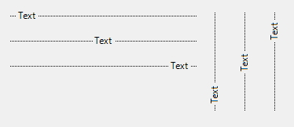

# More

A growing collection of (MIT licensed) Windows Forms Controls for .NET Core.

# Controls (Alphabetically)

 * [Line](#line)

# Line

Vertical or horizontal line control, used as a separator or a decorator. 

## Usage

Set the `Orientation` property to `Horizontal` or `Vertical`. Use line 
`Thickness` to set the pen thickness. Set line `Text`,`Font`, and `ForeColor` 
properties to control appearance of title. If empty, no title is shown.
`TextAlignment` tells where the title is shown (at beginning, end or in the
middle of line). If at beginning or end then `TextOffset` (in pixels) is
used to move title away from begin/end point. `BackColor` controls line control 
background, and `LineColor` is used for line color. `DashValues` is an array
of floats that tells size of pixels and spaces. Default value of `{1,0}` means
solid line (i.e. one pixel, followed by zero spaces). A value of `{1,1}` is
interpreted as a pixel followed by a space. The pattern can be of arbitrary
length i.e. a value of `{3,1,1,1}` would be interpreted three pixels, 
followed by one space, followed by one pixel, followed by one space.

## Examples

~~~cs
_line.Orientation = Orientation.Horizontal;
_line.Text = string.Empty; // Remove text.
_line.LineColor = Color.Khaki;
_line.BackColor = Color.DarkSeaGreen;
_line.Thickness = 6;
_line.DashValues = new float[] { 3,1,1,1 };
~~~

