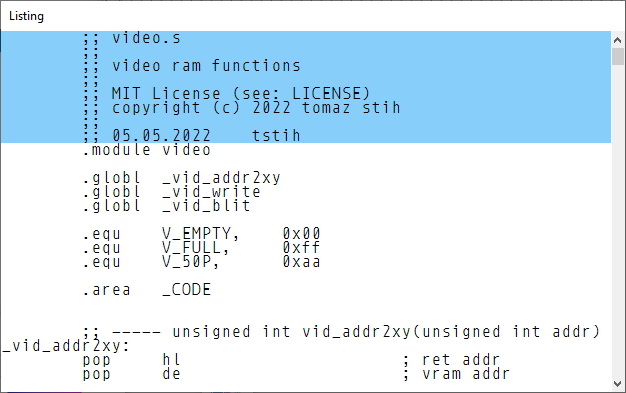
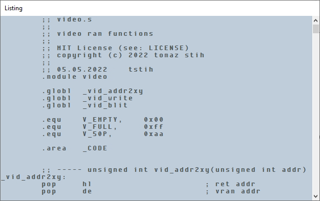
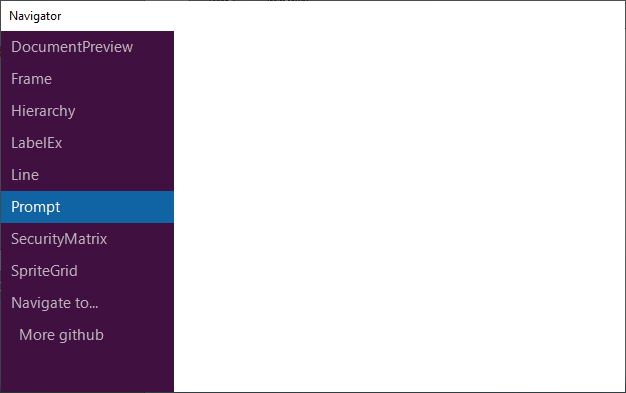
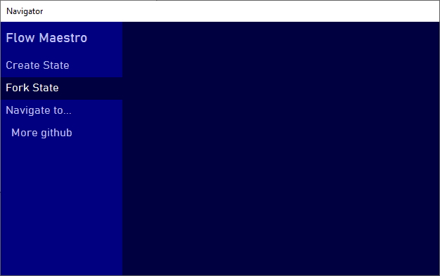
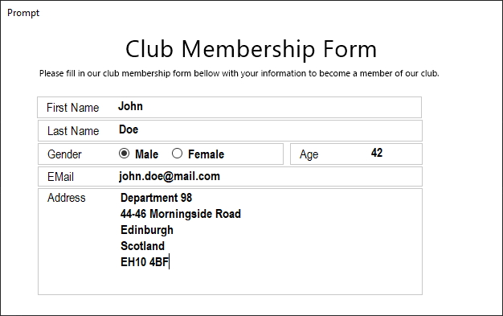
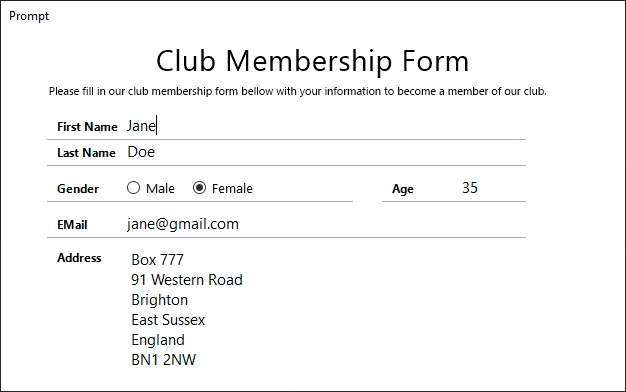
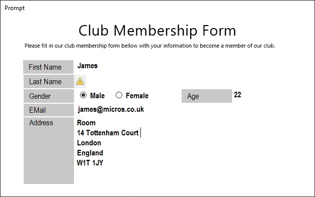

![status.badge] [![language.badge]][language.url] [![uilib.badge]][uilib.url] [![standard.badge]][standard.url] [![license.badge]][license.url]

# More

More is a growing collection of (MIT licensed) Windows Forms Controls for .NET Core.

# What's New?
~~~
**2022-05-21** Documented the Navigator and the Listing.
**2022-02-06** Added the Navigator control.
**2022-02-05** Added the Listing control for displaying source code. 
**2022-02-04** Created this Journal.
~~~

# What's Planned?

**2022-07-01** Demo project, final version of More.
**2022-06-01** Style templates and implementation of all TODO items.

# Controls (Alphabetically)

 * [DocumentPreview](#documentpreview) Show document preview and paint it in native units.
 * [Frame](#frame) Structure and draw on the panel without affecting the content.
 * [Hierarchy](#hierarchy) Draw and manipulate trees.
 * [LabelEx](#labelex) The label that can rotate text and supports transparency.
 * [Line](#line) Use a custom line as a separator or a decorator.
 * [Listing](#listing) Program code listing. You can use it for emulators, disassemblers, etc.
 * [Monitors](#monitors) Show multi-monitor setup and allow selecting one.
 * [Navigator](#navigator) Navigator is a vertical navigation bar with two levels.
 * [Prompt](#prompt) The Prompt control is a panel with a label. You can use it for forms.
 * [SecurityMatrix](#securitymatrix) SecurityMatrix is a classic *permissions and roles* grid.
 * [SpriteGrid](#spritegrid) Use sprite grid control to build a sprite editor.

---

# DocumentPreview

The `DocumentPreview` control paints the document background (*the ornaments*) and 
allows painting inside it, using native units. When the document needs to be painted,
it triggers the paint event, and your job is to paint into provided graphics context
using native units. 

## Usage

Set the document size in native units through the `DocumentSize` property. 
The default value is 210 x 297, which is the size of a standard DIN A4 document 
(in millimetres).  

 > When your document is an image, you can choose pixel as your unit and 
 > set the document size to bitmap size.

After setting the size of the document, subscribe to the `OnDocumentDraw` event.

When the document needs to be painted, the control will raise this event 
and pass it to the `Graphics`. Use it to draw the document in native units,
inside rectangle `(0,0,document width, document height)`. The control will
automatically perform scale and size to fit operations for you.

The following example shows how to draw grid lines and a red margin.

~~~cs
private void _doc_OnDocumentDraw(object sender, DocumentDrawEventArgs e)
{
    using (Pen gridPen = new Pen(Color.FromArgb(192, 192, 192)))
    using (Pen gridPenHigh=new Pen(Color.FromArgb(128, 128, 128)))
    {
        for (int x = 0; x < _doc.DocumentSize.Width; x+=10) 
            e.Graphics.DrawLine(x%30==0?gridPenHigh:gridPen, x, 0, x, _doc.DocumentSize.Height);
        for (int y = 0; y < _doc.DocumentSize.Height; y += 10)
            e.Graphics.DrawLine(y%30 == 0 ? gridPenHigh : gridPen, 0, y, _doc.DocumentSize.Width,y);
    }
    using(Pen p=new Pen(Color.Red,2)) // Draw margin.
        e.Graphics.DrawRectangle(p, new Rectangle(30, 30, _doc.DocumentSize.Width - 60, _doc.DocumentSize.Height - 60));
}
~~~

And the result is:

You can also set the `Shadow` property, the `PaperColor` property, and 
the `BorderColor` property for a more admirable effect. Finally, the background uses the `BackColor` property.

### Document folds

The document can have multiple folds. You can choose to display or hide folds by setting the
`Fold` property (top left, top right, bottom left, bottom right, or none). The size of the
fold is set via the `FoldPercent` property. A 50% value means the fold will span half of
the document.

 >  The `Fold` property is a flag. You may set more than one, and the control will show all.

The control will clip document content so that fold appears above it.

---

# Frame

To understand the `Frame` control, you first need to understand its base control - the
`PanelEx`. This control enables you to create a non-client border around the `PanelEx` 
and have WinForms respect it, for example, when docking children inside the `PanelEx`.

## Background: The PanelEx Control

To create a new container control with a non-client area, derive it from `PanelEx`, 
and set the `Margin`. The area outside will be the non-client area, and the area inside the margins 
will be the client area. 

 > For example, if you set all margins to 10 pixels, then a 10 pixels wide border
 > around the control will be the non-client area and the rest client area.

You can use the client area just as you would use the standard panel control i.e. 
you put controls inside, dock them, etc. If you want to paint on a non-client, override 
the `Decorate()` function.

The functionality of `PanelEx` provides the glue required to implement various container 
controls. Here are just a few possibilities:
 * Frame controls,
 * Collapsible controls,
 * Prompt controls.

### How to derive from PanelEx

Here is the skeleton of the panel, derived from the `PanelEx`. Margin is set
in the constructor, and drawing on the non-client area should happen inside the
`Decorate()`. This function prepares everything for you: it creates the graphics 
and calculates all rectangles that form the non-client border. 

~~~cs
public class MyPanel : PanelEx
{
    public class MyPanel() {
        // Create a 5 pixel unified non client 
        // area around the panel.
        Margin=new Padding(5,5,5,5);
    }

    protected override void Decorate(
        Graphics g, 
        Rectangle lt, // Left top rectangle of NC area.
        Rectangle rt, // Right top rectangle of NC area.
        Rectangle lb, // Left bottom rectangle of NC area.
        Rectangle rb, // Right bottom rectangle of NC area.
        Rectangle l, // Left rectangle of NC area.
        Rectangle t, // Top rectangle of NC area.  
        Rectangle r, // Right rectangle of NC area.
        Rectangle b) // Left top rectangle of NC area.
    {
        // Here you draw in nonclient area.
    }
}
~~~

## Frame Control: Usage

The Frame control has four areas. 
 * First (top) area is the title. You can set it via
   the `Title` property. It uses the `Font` property. You can set 
   values of the `TitleBackColor` and `TitleFrontColor`. The title
   is adjusted by `TitleAlignment`. If aligned left or right, the 
   `TitleOffset` is the indentation. Last but not least, you
   can increase or reduce (even hide!) title height by changing the 
   value of `TitleHeight`.
 * the Second area is the outer border. This border has `OuterBorderThickness`,
   `OuterBorderDarkColor` and `OuterBorderLightColor`. By convention, the
   dark colour is used for the top and left edge, and the light colour for the bottom
   and right edge. For the inset effect, swap these colours.
 * the Third area is the inner border. This border has `InnerBorderThickness`,
   `InnerBorderDarkColor` and `InnerBorderLightColor`. By default, the
   thickness is zero, so no inner border is shown.
 * Fourth area is the `BorderThickness` (in pixels). This is simply the space
   between the outer border and the inner border. It can be zero, but it is tough
   to differentiate between inner and outer borders.
 

## Examples

~~~cs
// First the title.
_frame.Title = "Hello!";
_frame.TitleAlignment = StringAlignment.Center;
_frame.TitleHeight = 16;
_frame.TitleBackColor = BackColor;
_frame.TitleForeColor = ForeColor;

// Outer border.
_frame.OuterBorderDarkColor = Color.FromKnownColor(KnownColor.ControlDark);
_frame.OuterBorderLightColor = Color.FromKnownColor(KnownColor.ControlLight);
_frame.OuterBorderThickness = 1;

// Inner border (replace dark and light).
_frame.InnerBorderDarkColor = Color.FromKnownColor(KnownColor.ControlLight);
_frame.InnerBorderLightColor = Color.FromKnownColor(KnownColor.ControlDark);
_frame.InnerBorderThickness = 1;

// Pixels between inner and outer color.
_frame.BorderThickness = 2;
~~~

The code above creates the frame below.

---

# Hierarchy

You can use the `Hierarchy` control to visualise trees. The control only manages the 
layout; it expects your code to draw content inside events.

## Usage

You set the tree direction by manipulating the `Direction` property.
The control can draw *left to right*, *right to left*, *top to bottom*, and *bottom
to top* trees. 

Basic general node properties (shared between all nodes!) are: `NodeWidth` 
and `NodeHeight`. The minimal space in pixels between two nodes is determined 
by the `NodeHorzSpacing` and `NodeVertSpacing` properties.

You feed the data into the control by implementing a simple `IHierarchyFeed`
interface, and then passing it to the `Hierarchy` via the `SetFeed()` method.

Here is the interface.

~~~cs
public interface IHierarchyFeed
{
    IEnumerable<string> Query(string key=null);
}
~~~

It only has one function, which returns a collection of node keys (node identifiers).
 
 > Since your code is responsible for drawing nodes and edges, the control 
 > does not need to know more about the node. When it needs to draw the node it passes the 
 > node key and rectangle in an event and expect your code to do the rest. 

The `Query()` function accepts a *parent key* parameter. If this parameter is null, 
the function returns all root node keys (usually just one?); otherwise, it returns the child
nodes of provided *parent node*.

You can capture all standard control mouse events, and inside the mouse events translate 
mouse coordinates to nodes key by calling `NodeAt()` function.

## Examples

### File system feed

Here's a simple feed implementation for the file system. 

~~~cs
public class FileSystemHierarchyFeed : IHierarchyFeed
{
    private string _rootDir;

    public FileSystemHierarchyFeed(string rootDir) { _rootDir = rootDir; }

    public IEnumerable<string> Query(string key = null)
    {
        if (key == null) return new string[] { _rootDir };
        else return Directory.EnumerateDirectories(key + @"\");
    }
}
~~~

The full path is used as a node key in the example above. If you wanted to draw
organigram, you'd probably use the database identifier of a person as the key.

  > Disclaimer: Letting the above file feed scan your `c:` drive is bad.
    Just sayin'. 

### Drawing functions

You can subscribe to two events: the `DrawEdge` event to an edge, i.e. a line 
connecting two nodes. And the `DrawNode` event to draw a node. Both events will pass you
the node key, node rectangle, and an instance of the `Graphics` for drawing.

 > But drawing nodes and edges is your job.

This sample demonstrates drawing inside both events.

~~~cs
private void _hierarchy_DrawEdge(object sender, DrawEdgeEventArgs e)
{
    // Calculate node centers.
    Point
        start = new Point(
            e.ParentRectangle.Left + e.ParentRectangle.Width / 2,
            e.ParentRectangle.Top + e.ParentRectangle.Height / 2),
        end = new Point(
            e.ChildRectangle.Left + e.ChildRectangle.Width / 2,
            e.ChildRectangle.Top + e.ChildRectangle.Height / 2);
    // And draw the line.
    using (Pen p = new Pen(ForeColor)) 
        e.Graphics.DrawLine(p,start,end);
}

private void _hierarchy_DrawNode(object sender, DrawNodeEventArgs e)
{
    // Extract directory name from the path.
    string dir= Path.GetFileName(Path.GetDirectoryName(e.Key+@"\"));

    // Draw the node.
    Graphics g = e.Graphics;
    using (Pen forePen = new Pen(ForeColor))
    using (Brush backBrush = new SolidBrush(BackColor),
        foreBrush = new SolidBrush(ForeColor))
    using(StringFormat sf=new StringFormat() { 
        LineAlignment=StringAlignment.Center, 
        Alignment=StringAlignment.Center})
    {
        g.FillRectangle(backBrush, e.Rectangle); // Border.
        g.DrawRectangle(forePen, e.Rectangle); // Rectangle.
        g.DrawString(dir, Font, foreBrush, e.Rectangle, sf); // Text.
    }
}
~~~

### Mouse input

You can subscribe to standard mouse events (clicks, moves, etc.) and use the `NodeAt()` 
function to find out which node was clicked. For example, if you'd like to 
highlight a node on click, subscribe to the `MouseUp` event, find out which node was
clicked, store its key, and call `Refresh()` to repaint the control.

~~~cs
private string _highlightedNodeKey;
private void _hierarchy_MouseUp(object sender, MouseEventArgs e)
{
    _highlightedNodeKey = _hierarchy.NodeAt(e.Location);
    _hierarchy.Refresh();
}
~~~

Then, in the `DrawNode` event, check the node key against the `_highlightedNodeKey` and
paint it accordingly.

### Styling edges

Because the `DrawEdge` event gives you both ends of the edge - the parent node and 
You can choose how to draw your edge with the child node (with their coordinates). 
It can be a line, a curve, etc. You may also start your edge at the end of the parent node. 
(instead of the node centre) and draw it to the start of the other node. The following code does
just that; see the image for the result.

~~~cs
private void _hierarchy_DrawEdge(object sender, DrawEdgeEventArgs e)
{
    // Change start and end location of an edge.
    Point
        start = new Point(
            e.ParentRectangle.Right,
            e.ParentRectangle.Top + e.ParentRectangle.Height / 2),
        end = new Point(
            e.ChildRectangle.Left,
            e.ChildRectangle.Top + e.ChildRectangle.Height / 2);
    using (Pen p = new Pen(ForeColor))
        e.Graphics.DrawLine(p, start, end);
}
~~~

---

# LabelEx

LabelEx is a label control with roration and transparency features.

## Usage

Transparency is a pain in Windows Forms. This feature works well at runtime but behaves 
naughty in the designer. The reason is that it avoids double buffering to implement 
transparency. To make the label background transparent, set the `Opacity` property 
from 0% to 100% (for a fully transparent label). 

Rotate the label by setting the `Angle`. The unit is in degrees, and the rotation is clockwise.

Finally, you can align the rotated label to the bounding rectangle by assigning values to 
properties `HorzAlignment` and `VertAlignment`.

## Examples

~~~cs
_label.Text = "Oh, what a night\nLate December back in sixty - three\nWhat a very special time for me\nAs I remember what a night.";
_label.Angle = 45;
_label.HorzAlignment = StringAlignment.Center;
_label.VertAlignment = StringAlignment.Center;
~~~

And the result...

---

# Line

Use a custom line as a separator or a decorator. 

## Usage

Set the `Orientation` property to `Horizontal` or `Vertical`. Use line 
`Thickness` to set the pen thickness. Set line `Text`,`Font`, and `ForeColor` 
properties to control the appearance of the title. If empty, no title is shown.
`TextAlignment` tells where the title is shown (at the beginning, end or in the
middle of the line). If at the beginning or end, then `TextOffset` (in pixels) is
used to move the title away from the beginning/endpoint. `BackColor` controls line control 
background, and `LineColor` is used for line color. `DashValues` is an array
of floats that tells the size of pixels and spaces. The default value of `{1,0}` means
a solid line (i.e. one pixel, followed by zero spaces). A value of `{1,1}` is
interpreted as a pixel followed by a space. The pattern can be of arbitrary
length, i.e. a value of `{3,1,1,1}` would be interpreted as three pixels, 
followed by one space, followed by one pixel, followed by one space.

## Examples

~~~cs
_line.Orientation = Orientation.Horizontal;
_line.Text = string.Empty; // Remove text.
_line.LineColor = Color.Khaki;
_line.BackColor = Color.DarkSeaGreen;
_line.Thickness = 6;
_line.DashValues = new float[] { 3,1,1,1 };
~~~

---

# Listing

Program code listing. You can use it for emulators, disassemblers, etc.

## Usage

### Appearance

Set the standard properties for the listing, i.e. `Font`, `BackColor`, and `ForeColor` to whatever you wish. Then set the feeder using the `SetFeed()` method, and the control will draw the code and formatting provided by the feeder. 

### Feed

The Listing workspace is divided into rows, and each row is divided into cells. The height of each row can be configured using the `RowHeight` property and the width of each cell using the `CellWidth` property.
Each cell can have its background and foreground colour.
If not set on the lower level, colours are inherited, i.e. if you do not set colour for the row, the row inherits it from the control. 

Cell content is obtained from the `IListingFeed`. This interface returns all rows.  

~~~cs
public interface IListingFeed
{
    ListingRow QueryRow(int rowNo);
    int RowCount();
}
~~~

You can set the fore and back colours for each row. Each row also contains a collection of `ListingCell` objects.

~~~cs
public class ListingRow
{
    public ListingRow(string text, Color? foreColor = null, Color? backColor = null) {
        /* Create columns. */
        List<ListingCell> defaultRow = new List<ListingCell>();
        foreach(char character in text)
            defaultRow.Add(new ListingCell(character));
        Row = defaultRow.ToArray();
        /* Remember fore and back color. */
        ForeColor = foreColor;
        BackColor = backColor;
    }

    public ListingCell[] Row { get; set;  }

    public Color? BackColor { get; set; }
    public Color? ForeColor { get; set; }
}
~~~

The `ListingCell` contains background and foreground colour for the cell as well as character. If 'ForeColor` or `BackColor` properties are `null`, values are inherited from the row.

~~~cs
public class ListingCell
{
    public ListingCell(char character, Color? foreColor=null, Color? backColor=null)
    {
        Character = character;
        ForeColor = foreColor;
        BackColor = backColor;
    }

    public char Character { get; set; }
    public Color? BackColor { get; set; }
    public Color? ForeColor { get; set; }
}
~~~

### Feeder Example

This example of a feeder reads a text file and feeds it to the control. 

~~~cs
public class TextFileFeed : IListingFeed
{
    ListingRow[] _rows;
    public TextFileFeed(string fname)
    {
        List<ListingRow>  rows = new List<ListingRow>();
        foreach(string row in File.ReadAllLines(fname))
            rows.Add(new ListingRow(row));
        _rows = rows.ToArray();
    }
    public ListingRow QueryRow(int rowNo) { return _rows[rowNo]; }
    public int RowCount() { return _rows.Length; }
}
~~~

### Character alignment

You can align cells' content by setting the `CellAlign` and `CellLineAlign` properties.

### Scrolling

There is no standard scroll bar. Instead, you must implement scrolling yourself using a property called `TopRow`. This property tells the system which row is the first row on the screen. While scrollbars would be somehow inflexible, the top row approach enables synchronization of position inside multiple windows.
To implement a scrollbar, add it to your window, set its' min and max to the number of rows, and handle its `Scroll` event like this.

~~~cs
private void _scroll_Scroll(object sender, ScrollEventArgs e)
{
    _listing.TopRow = e.NewValue;
}
~~~

---

# Monitors

With the Monitors control, you can show the user their multi-monitor configuration
and enable them to select one. This feature is helpful in creating multi-monitor 
applications. You can let the user configure target monitors for
these windows.

 > The control will automatically detect the size and placement of connected monitors.

## Usage

### Margin and padding

Place the control on your window. All your monitors will be selected and drawn
in default colours. In addition, you can configure the `Padding` property to create space between
monitors. You can also set the `Margin` property for this control.

### Monitor number

If you set the `ShowNumber` property - you will display numbers inside
monitors. You can toggle font for displaying numbers by setting the `Font` 
property.

Numbers are displayed as outline text. The border colour for each number is configured
by setting `MonitorTextForeColor`, and the inner colour of the text is configured 
via the `MonitorTextBackColor`.

### Monitor edge

Each monitor can be a square, or it can have a 3D border *as real-life monitors
do*. You must set the `ShowEdge` property if you'd like a border. You can
configure 3D colours by setting the `EdgeLightColor` and `EdgeDarkColor`.
The space between the outer border and the inner border is configured by setting
the `EdgeThickness` value.

### Active monitor

When moving (hovering), the mouse over the monitors will be highlighted. To set the 
colours of monitor under the mouse, use the `ActiveMonitorBackColor` and
`ActiveMonitorBackColor` properties.

You can manually activate a monitor (without a mouse over it) by setting the 
`Activate` property to monitor number.

### Select monitor

When clicking on a monitor, you select it, and an event called `MonitorSelected` 
is raised.

 > You can also capture the `MonitorUnselected` event to detect when a monitor is
 > unselected.

You can set the selected monitor manually via the `Selected` numeric property. 

Properties` SelectedMonitorBackColor and `SelectedMonitorForeColor` configure the 
visual effects for selected monitor`

### Monitor colour

Monitor only uses one colour, called the `MonitorBackColor`. Please set it to 
whatever the standard back colour for the monitor should be.

---

# Navigator

Navigator is a vertical navigation bar with two levels.

## Usage

### Appearance

Configure the navigator items by changing the standard `ForeColor`, `BackColor`,
and `Font` properties. Additional behaviour properties are> `HoverBackColor`, 
`HoverForeColor`, `SelectedBackColor`, and `SelectedForeColor`.

You can configure item size and indent by setting the `ItemHeight` and
`ItemIndent` properties. Item layout also respects the `Padding` property.

Add the title by setting the `Text` property. Customize it by changing
`TitleHeight`, `TitleFont`, `TitleSeparatorColor` and the `Title` colour.
The title always uses the background colour of the control.

### Navigation

The navigator supports two levels of navigation and uses a feeder. You can
set the feeder by calling the `SetRoot()` method and passing it the 
`IEnumerable<NavigatorItemBase>` collection.

You can pass any derivate class too. The `Navigator` supports the following 
derivates:

~~~cs
public class NavigatorItemBase
{
    public string Text { get; set; }
    public Action Callback { get; set; }
    public string Key { get; set; }
    public bool Disabled { get; set; }
}

public class NavigatorItem : NavigatorItemBase
{
    public Image Glyph { get; set; }
}

public class NavigatorCategory : NavigatorItemBase
{
    public NavigatorCategory()
    { Children=new List<NavigatorItem>(); }
    public List<NavigatorItem> Children { get; }
}
~~~

## Fluent Feeder

To make your life easier, we have created a fluent interface
that you can use to create quick navigators. First, you need to call
the `NavigatorBuilder.Fluent()` function and fluently
add item texts, callback functions, glyphs and shortcut keys.

~~~cs
// Place the control on a window and call it _navigator.
// Then inside OnLoad Window event do this --
_navigator.SetRoot(
    NavigatorBuilder.Fluent()
        .Add("Create State", ()=>CreateState(), null, "Alt+C") // No image
        .Add("Fork State")
        .Begin("Navigate to...")
            .Add("More github")
        .End()
        .GetRoot()
);
~~~

## ToDo

 * Finish keyboard shortcuts, and 
 * add flexibility to the title separator.

---

# Prompt

The `Prompt` control helps you consistently align your controls on the form. It adds
a prompt and a glyph in front of them in a consistent way. 

## Usage

Add the `Prompt` control to your window. You can now place the content, i.e. the 
control you'd like to host (such as a `TextBox`) on top of the `Prompt` control, 
and dock it. 

As the `Prompt` control derives from the `Panel` it will treat your `TextBox`
as a child, move and resize it correctly whenever you move the `Prompt` control. 

You can customize the layout and the appearance of your `Prompt` control.

### Borders and Margins

You may manage border thickness with four properties: `LeftBorderThickness`, 
`RightBorderThickness`, `TopBorderThickness`, and `BottomBorderThickness`, and 
set the border colour via the `BorderColor` property. 

 > A value of 0 for border thickness means no border.

### Content

Standard control properties `Font` and `BackColor` are applied to the hosted 
control (i.e. to the control you place on top of the `Prompt` control). 
In addition, you can set the `ContentMargin` to create an extra margin inside 
the content space. 

 > This is useful when you want to separate your control and the prompt
 > text with a few pixels.

### The Prompt

Prompt text is controleld by the `Text`, `PromptTextWidth`, `PromptForeColor`, 
`PromptBackColor`, `PromptTextAlignment`, `PromptTextLineAlignment`,and
`PromptTextEdge` properties. All properties are straightforward, except
the `PromptTextEdge`. This is used in combination with `PromptTextAlignment`.
If the latter is `Left`, then the `PromptTextEdge` is the number of pixels from 
the edge of control (the absolute left) to the prompt text. If the `PromptTextAlignment` property
is right, it defines the number of pixels from the right prompt edge.

 > You can also set `PromptTooltip`, which will be shown if you hover over the
 > prompt text and is useful for showing field instructions to the user. 
 > An empty value will disable the tooltip.

### Glyph

You can set a prompt glyph. It will be shown right of your prompt text. You may
use this feature for validation alerts, etc. 

 > Recommended glyph size is 16 x 16 pixels.

As long as the `Glyph` property is null, the space for glyph 
**will not be reserved** within the control. Once you set the `Glyph` property, 
it will not be shown until you set the `GlyphVisible` property to true. 
This is how you can toggle validation alerts. 

The glyph has its own back colour controlled by the `GlyphBackColor`. It also
has custom `GlyphWidth` (default:16), while the height equals `Prompt` control
height. Within this rectangle, you can align glyphs by setting the `GlyphAlignment`. 

Last but not least, the glyph can also have an independent tooltip. You could use
this for explaining a validation error. You can toggle this on by setting the
`GlyphTooltip` to a non-empty value.

---

# SecurityMatrix

A highly configurable classic *permissions and roles* grid editor. It accepts 
a feed interface which must provide a list of roles, permission categories, 
and permissions. A demo feed implementation is part of the control. 

You can configure fonts and colours of the control or implement custom drawing.
Custom drawing is implemented by overriding the control's paint functions.

## Usage

Place the `SecurityMatrix` on your window. It will show a demo matrix enabling you
to customize its' appearance.

Call the `SetFeed()` function to pass the data to it. Set angle for roles by setting
the `RolesAngle` property. Reserve space on top and the left for roles and categories
by setting the `RolesHeight` and `CategoriesWidth` properties. Set the tick cell 
size by setting the property `CellSize`. 

You can configure fore and front colours and fonts for matrix titles on the top
and left. You can also configure cells' fore and front colours. Finally, when the
mouse hovers over the cell, it will change colour if you set the `PermissionActiveCellBackColor`
property.

## Implementing the feed

To implement the feed interface, you need to implement four functions.

~~~cs
public interface ISecurityMatrixFeed
{
    IEnumerable<SecurityRole> QueryRoles();
    IEnumerable<SecurityCategory> QueryCategories();
    IEnumerable<SecurityPermission> QueryPermissions(SecurityCategory category);
    bool this[SecurityRole r, SecurityCategory c, SecurityPermission p] { get; set; } 
}
~~~

Functions accept parameters of types SecurityRole, SecurityPermission, and SecurityCategory
which are all derived from `KeyNamePair` and must contain two values: 
 * a display name, and 
 * a unique identifier.

~~~cs
public class KeyNamePair
{
    public string Id { get; set; }
    public string DisplayName { get; set; }
}
public class SecurityRole : KeyNamePair {}
public class SecurityCategory : KeyNamePair {}
public class SecurityPermission : KeyNamePair {}
~~~

Function `QueryRoles()` should return all roles that you'd like to have displayed
on top. Function `QueryCategories()` should return all categories into which you would
like to group permissions. Function `QueryPermissions()` takes a category object as a
parameter and returns all permissions of this category. And finally,
the indexer `this[SecurityRole, SecurityCategory, SecurityPermission]`is used to 
access the ticks. 

### Binding ticks to database

The indexer inside the feed can be connected to the database, updated on set and
read from it on getting. Following is a naive implementation of the indexer as a list.

~~~cs
private class Check
{
    public SecurityRole SecurityRole { get; set; }
    public SecurityCategory SecurityCategory { get; set; }
    public SecurityPermission SecurityPermission { get; set; }
    public bool Value { get; set; }
}
// ...code omitted...
private List<Check> _checks;
// ...code omitted...
public bool this[SecurityRole r, SecurityCategory c, SecurityPermission p] { 
    get {
        var chk = _checks.FirstOrDefault(chk =>
            chk.SecurityRole.Id.Equals(r.Id)
            && chk.SecurityCategory.Id.Equals(c.Id)
            && chk.SecurityPermission.Id.Equals(p.Id));
        if (chk == null) return false;
        else return chk.Value;
    }
    set
    {
        var chk = _checks.FirstOrDefault(chk =>
            chk.SecurityRole.Id.Equals(r.Id)
            && chk.SecurityCategory.Id.Equals(c.Id)
            && chk.SecurityPermission.Id.Equals(p.Id));
        if (chk != null)
            chk.Value = value;
        else
            _checks.Add(new Check() { 
                SecurityRole=r, SecurityCategory=c, SecurityPermission=p, Value=value 
            });
    }
} 
~~~

### Custom paint

You can derive your control from the `SecurityMatrix` and implement custom
paint handlers for every aspect of the grid.

~~~cs
public class SecurityMatrixEx : SecurityMatrix
{
    protected override void DrawTick(Graphics g, Rectangle rect)
    {
        rect.Inflate(-12, -12);
        using (Pen tickPen = new Pen(Color.Black, 2))
        {
            g.DrawLine(tickPen, rect.Location, new Point(rect.Right, rect.Bottom));
            g.DrawLine(tickPen, new Point(rect.Right, rect.Top), new Point(rect.Left, rect.Bottom));
        }
    }

    protected override void DrawPermissionCellBackground(Graphics g, Rectangle rect, SecurityRole r, SecurityCategory c, SecurityPermission p)
    {
        rect.Inflate(-8, -8);
        g.DrawRectangle(Pens.Gray, rect);
    }

    protected override void DrawPermissionCellForeground(Graphics g, Rectangle rect, SecurityRole r, SecurityCategory c, SecurityPermission p)
    { // Don't draw rectangle around it!
    }
}
~~~

This code above changes ticks to squares, and produces the following output:

You can override the following paint functions.

~~~
void DrawRoleBackground(Graphics g, Point[] pts, SecurityRole role)
void DrawRoleForeground(Graphics g, Rectangle r, SecurityRole role)
void DrawPermissionBackground(
            Graphics g,
            Rectangle r,
            SecurityCategory category,
            SecurityPermission permission)
void DrawPermissionForeground(
            Graphics g,
            Rectangle r,
            SecurityCategory category,
            SecurityPermission permission)
void DrawTick(Graphics g, Rectangle rect)
void DrawPermissionCellBackground(
            Graphics g,
            Rectangle rect,
            SecurityRole r,
            SecurityCategory c,
            SecurityPermission p)
void DrawPermissionCellForeground(
            Graphics g,
            Rectangle rect,
            SecurityRole r,
            SecurityCategory c,
            SecurityPermission p)
void DrawCategoryForeground(Graphics g, Rectangle r, SecurityCategory category)
void DrawCategoryBackground(Graphics g, Rectangle r, SecurityCategory c)
void DrawCategoryCellBackground(Graphics g, Rectangle rect, SecurityRole r, SecurityCategory c)
void DrawCategoryCellForeground(Graphics g, Rectangle rect, SecurityRole r, SecurityCategory c)
~~~

The control implements all the sizing and rotation operations, so you don't have
to worry about it, i.e. you don't need to draw rotated text for the role, and it is rotated and placed to
the correct rectangle for you by the control.

## ToDo

Keyboard and focus handling.

---

# SpriteGrid

Use sprite grid control to build a sprite editor.

## Usage

Place the `SpriteGrid` control on your window. Set its `SourceImage` property to
the `Bitmap` you'd like to view or edit.

You can show or hide rulers using the `ShowHorzRuler` and `ShowVertRuler` properties.
You can customize rulers by manipulating properties: `RulerHeight`, `RulerWidth`, 
`RulesBackgroundColor`, `MinorTickSize`, `MajorTickSize`, and 'MinorTicksPerMajorTick'.

You can customize grid appearance by manipulating properties `GridEdgeLineColor`,`GridEdgeLineDashPattern`,
`GridTickLineColor`, `GridTickLineDashPattern`.

`BackColor` is used to draw an empty grid, and `ForeColor` is used for all text (currently just
the ruler content).

## Examples

### Passing image

You can pass the image to SpriteGrid by assigning the image to the `SourceImage` property.

~~~cs
_spriteGrid.SourceImage = Image.FromFile("pacman.png");
~~~

### Responding to events

SpriteGrid exposes basic mouse events and translates physical coordinates to logical
coordinates inside the sprite (i.e. row and column). To manipulate the sprite, 
simply manipulate the underlying image and call the `Refresh()` function on
SpriteGrid.

~~~cs
public partial class MainWnd : Form
{
    // ... code omitted ...
    private Bitmap _sprite;

    private void MainWnd_Load(object sender, System.EventArgs e)
    {
        // Create new 16x16 sprite.
        _spriteGrid.SourceImage = _sprite = new Bitmap(16, 16);
    }

    private void _spriteGrid_CellMouseDown(object sender, CellMouseButtonArgs e)
    {
        // Set image pixel.
        _sprite.SetPixel(e.Column, e.Row, Color.Black);
        _spriteGrid.Refresh();
    }
    // ... code omitted ...
}
~~~

### Implementing zoom

SpriteGrid uses a mouse wheel for two purposes. Sprite is scrolled up and down 
if the wheel is used without any control key. If, while using the mouse wheel, 
you hold down the Ctrl key, then the `ZoomIn` and `ZoomOut` events are triggered. 

You can use this to implement zoom.

The simplest implementation (which would not consider the current mouse position),
would be increasing and decreasing values or properties `CellWidth` and `CellHeight`.

~~~cs
private void _spriteGrid_ZoomIn(object sender, ZoomInArgs e)
{
    if (_spriteGrid.CellWidth < 32) _spriteGrid.CellWidth++;
    if (_spriteGrid.CellHeight < 32) _spriteGrid.CellHeight++;
}

private void _spriteGrid_ZoomOut(object sender, ZoomOutArgs e)
{
    if (_spriteGrid.CellWidth > 1) _spriteGrid.CellWidth--;
    if (_spriteGrid.CellHeight > 1) _spriteGrid.CellHeight--;
}
~~~

And here is the result.

### Visible margins

Sometimes it makes sense to set a visible sprite margin (for example, to show where
the image will be cropped). Six properties controlling sprite margin: `LeftMargin`,
`RightMargin`, `TopMargin`, `BottomMargin`, `MarginLineThickness`, and
`MarginColor`.

 > Sprite margin is not the same as the control margin. Sprite margin is an area of the sprite
 > that is visibly marked.

~~~cs
_spriteGrid.SourceImage = Image.FromFile("art.png");
_spriteGrid.LeftMargin = 40;
_spriteGrid.RightMargin = 40;
_spriteGrid.TopMargin = 30;
_spriteGrid.BottomMargin = 40;
_spriteGrid.MarginLineThickness = 4;
_spriteGrid.MarginColor = Color.Red;
~~~

### Selections

By responding to mouse events `CellMouseDown`, `CellMouseUp, `CellMouseMove` you 
can detect select operation.

 > To differentiate between a select and a pixel click, you need to compare the mouse
 > coordinates at `CellMouseDown` event with that of `CellMouseUp`. If 
 > coordinates are the same, and there were no `CellMouseMove` events out o the
 > cell, then it is a click. Otherwise, it is selected.

To make SpriteEdit draw a selection, you set the property GridSelection. 
GridSelection is a polygon and can be of any shape.

~~~cs
_spriteGrid.SourceImage = Image.FromFile("jetpac.png");
_spriteGrid.SetGridSelection(new GridSelection()
{
    LineColor = Color.White,
    LineWidth = 3,
    Poly = new Point[] { 
        new Point(200,200), 
        new Point(400, 200), 
        new Point(400,400), 
        new Point(200,400)}
});
~~~

[language.url]:   https://docs.microsoft.com/en-us/dotnet/standard/net-standard
[language.badge]: https://img.shields.io/badge/language-csharp-blue.svg

[uilib.url]:   https://docs.microsoft.com/en-us/dotnet/desktop/winforms/?view=netdesktop-5.0
[uilib.badge]: https://img.shields.io/badge/ui%20library-winforms-blue.svg

[standard.url]:   https://dotnet.microsoft.com/download/dotnet/3.1
[standard.badge]: https://img.shields.io/badge/dotnet-core%203.1-blue.svg

[license.url]:    https://github.com/tstih/more/blob/master/LICENSE
[license.badge]:  https://img.shields.io/badge/license-MIT-blue.svg

[status.badge]:  https://img.shields.io/badge/status-stable-dkgreen.svg
