# More

*by Tomaz Stih*

A growing collection of (MIT licensed) Windows Forms Controls for .NET Core.

# Controls (Alphabetically)

 * [DocumentPreview](#documentpreview) Show document preview and paint it in native units.
 * [Frame](#frame) Structure and draw on panel without affecting the content.
 * [Hierarchy](#hierarchy) Draw and manipulate trees.
 * [LabelEx](#labelex) Label that can rotate and supports transparency.
 * [Line](#line) Use custom line as a separator or a decorator.
 * [Monitors](#monitors) Show multi-monitor setup and allow selecting one.
 * [SecurityMatrix](#securitymatrix) Classic *permissions and roles* grid.
 * [SpriteGrid](#spritegrid) Use sprite grid control to build a sprite editor.

---

# DocumentPreview

The `DocumentPreview` control paints the document background (*the ornaments*) and 
allows painting inside it, using native units. When the document needs to be painted,
it triggers the paint event and your job is to paint into provided graphics context
using native units. 

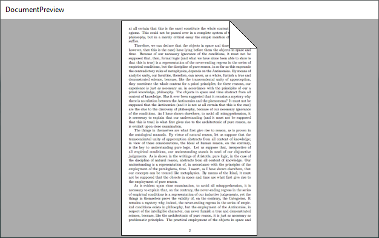
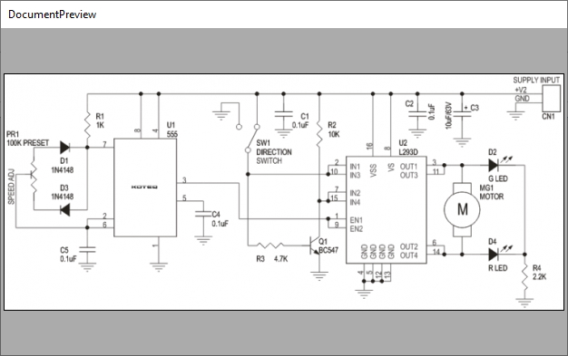

## Usage

Set the document size in native units through the `DocumentSize` property. 
Default value is 210 x 297, which is the size of standard DIN A4 document 
(in millimeters).  

 > When your document is an image, you can choose pixel as your unit and 
 > set the document size to bitmap size.

After setting the document size subscribe to the `OnDocumentDraw` event.

When the document needs to be painted the control will raise this event 
and pass it the `Graphics`. Use it to draw the document in native units,
inside rectangle `(0,0,document width, document height)`. The control will
automatically perform scale and size to fit operations for you.

Following example shows how to draw grid lines and red margin.

~~~cs
private void _doc_OnDocumentDraw(object sender, DocumentDrawEventArgs e)
{
    using (Pen gridPen = new Pen(Color.FromArgb(192, 192, 192)))
    using (Pen gridPenHigh=new Pen(Color.FromArgb(128, 128, 128)))
    {
        for (int x = 0; x < _doc.DocumentSize.Width; x+=10) 
            e.Graphics.DrawLine(x%30==0?gridPenHigh:gridPen, x, 0, x, _doc.DocumentSize.Height);
        for (int y = 0; y < _doc.DocumentSize.Height; y += 10)
            e.Graphics.DrawLine(y%30 == 0 ? gridPenHigh : gridPen, 0, y, _doc.DocumentSize.Width,y);
    }
    using(Pen p=new Pen(Color.Red,2)) // Draw margin.
        e.Graphics.DrawRectangle(p, new Rectangle(30, 30, _doc.DocumentSize.Width - 60, _doc.DocumentSize.Height - 60));
}
~~~

And the result is:

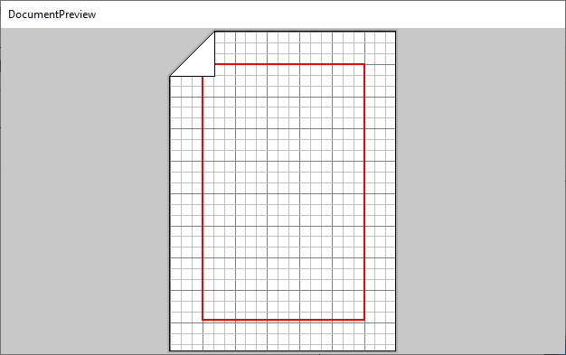

For a nicer effect you can also set the `Shadow` property, the `PaperColor` property and 
the `BorderColor` property. The background is drawn in `BackColor` property.

### Document folds

Document can have multiple folds. You can choose to display or hide folds by setting the
`Fold` property (top left, top right, bottom left, bottom right, or none). The size of the
fold is set via the `FoldPercent` property. A 50% value means fold will span half of
the document.

 >  The `Fold` property is a flag. You may set more then one and all will be shown.

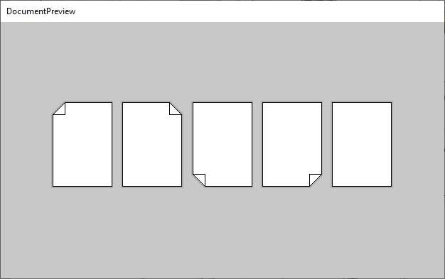

Document content will be clipped so that fold appears above it.

---

# Frame

To understand the `Frame` control, you first need to understand its base control - the
`PanelEx`. This control enables you to create non-client border around the `PanelEx`, 
and have WinForms respect it, for example, when docking children inside the `PanelEx`.

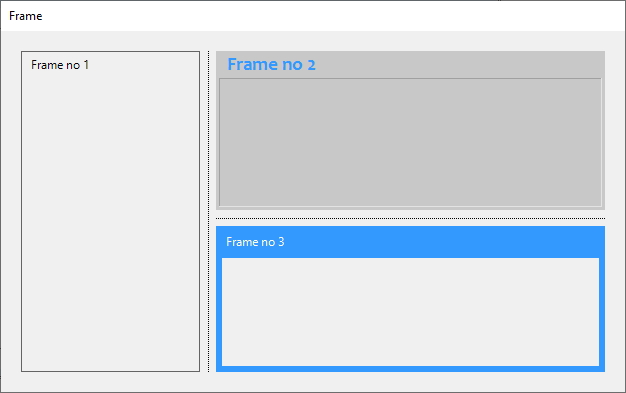

## Background: The PanelEx Control

To create a new container control with a non-client area, derive it from `PanelEx`, 
and set the `Margin`. Area outside will be non-client area and area inside the margins 
the client area. 

 > For example, if you set all margins to 10 pixels, then a 10 pixels wide border
 > around the control will be non-client area, and the rest client area.

You can use the client area just as you would use the standard`Panel` control i.e. 
you put controls inside, dock them, etc. If you want to paint on non-client, override 
the `Decorate()` function.

The functionality of `PanelEx` provides glue, required to implement various container 
controls. Here are just a few possibilities:
 * Frame controls,
 * Collapsible controls,
 * Prompt controls...

### How to derive from PanelEx

Here is the skeleton of panel, derived from the `PanelEx`. Margin is set
in the constructor, and drawing on non-client area should happen inside the
`Decorate()`. This function prepares everything for you: it creates the graphics 
and calculates all rectangles that form the non-client border. 

~~~cs
public class MyPanel : PanelEx
{
    public class MyPanel() {
        // Create a 5 pixel unified non client 
        // area around the panel.
        Margin=new Padding(5,5,5,5);
    }

    protected override void Decorate(
        Graphics g, 
        Rectangle lt, // Left top rectangle of NC area.
        Rectangle rt, // Right top rectangle of NC area.
        Rectangle lb, // Left bottom rectangle of NC area.
        Rectangle rb, // Right bottom rectangle of NC area.
        Rectangle l, // Left rectangle of NC area.
        Rectangle t, // Top rectangle of NC area.  
        Rectangle r, // Right rectangle of NC area.
        Rectangle b) // Left top rectangle of NC area.
    {
        // Here you draw in nonclient area.
    }
}
~~~

## Frame Control: Usage

Back to our `Frame` control. 

It has four areas. 
 * First (top) area is the title. You can set it via
   the `Title` propety. It uses the `Font` property. You can set 
   values of the `TitleBackColor` and `TitleFrontColor`. The title
   is adjusted by `TitleAlignment`. If aligned left or right, the 
   `TitleOffset` is the identation. Last but not least, you
   can increase or reduce (even hide!) title height by changing the 
   value of `TitleHeight`.
 * Second area is the outer border. This border has `OuterBorderThickness`,
   `OuterBorderDarkColor` and `OuterBorderLightColor`. By convention the
   dark color is used for top and left edge, and the light color for the bottom
   and right edge. For the inset effect, simply swap these colors.
 * Third area is the inner border. This border has `InnerBorderThickness`,
   `InnerBorderDarkColor` and `InnerBorderLightColor`. By default the
   thickness is zero so no inner border is shown.
 * Fourth area is the `BorderThickness` (in pixels). This is simply the space
   between outer border and inner border. It can be zero but then it is very hard
   to differentiate between inner and outer border.
 

## Examples

~~~cs
// First the title.
_frame.Title = "Hello!";
_frame.TitleAlignment = StringAlignment.Center;
_frame.TitleHeight = 16;
_frame.TitleBackColor = BackColor;
_frame.TitleForeColor = ForeColor;

// Outer border.
_frame.OuterBorderDarkColor = Color.FromKnownColor(KnownColor.ControlDark);
_frame.OuterBorderLightColor = Color.FromKnownColor(KnownColor.ControlLight);
_frame.OuterBorderThickness = 1;

// Inner border (replace dark and light).
_frame.InnerBorderDarkColor = Color.FromKnownColor(KnownColor.ControlLight);
_frame.InnerBorderLightColor = Color.FromKnownColor(KnownColor.ControlDark);
_frame.InnerBorderThickness = 1;

// Pixels between inner and outer color.
_frame.BorderThickness = 2;
~~~

The code above creates the frame below.

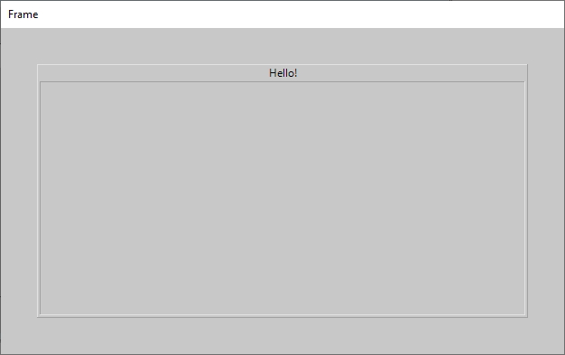

---

# Hierarchy

You can use the `Hierarchy` control to visualise trees. The control only does the 
layouting; it expects your code to draw content inside events.

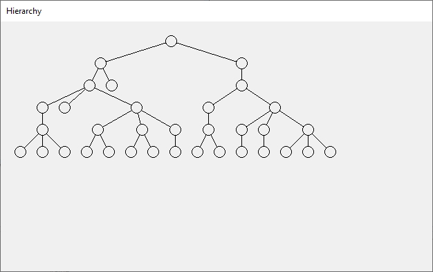

## Usage

You set the tree direction by manipulating the `Direction` property.
The control can draw *left to right*, *right to left*, *top to bottom*, and *bottom
to top* trees. 

Basic general node properties (shared between all nodes!) are: `NodeWidth` 
and `NodeHeight`. The minimal space in pixels between two nodes is determined 
by the `NodeHorzSpacing` and `NodeVertSpacing` properties.

You feed the data into the control by implemening a simple `IHierarchyFeed`
interface, and then passing it to the `Hierarchy` via the `SetFeed()` method.

Here is the interface.

~~~cs
public interface IHierarchyFeed
{
    IEnumerable<string> Query(string key=null);
}
~~~

It only has one function which returns a collection of node keys (node identifiers).
 
 > Since your code is responsible for drawing nodes and edges, the control really 
 > does not need to know more about the node. When it needs to draw it it passes the 
 > node key and rectangle in an event and expects your code to do the rest. 

The `Query()` function accepts a *parent key* parameter. If this parameter is null, 
the function returns all root node keys (usually just one?), otherwise it returns child
nodes of provided *parent node*.

You can capture all standard control mouse events, and inside the mouse events translate 
mouse coordinates to nodes key by calling `NodeAt()` function.

## Examples

### File system feed

Here's a simple feed implementation for the file system. 

~~~cs
public class FileSystemHierarchyFeed : IHierarchyFeed
{
    private string _rootDir;

    public FileSystemHierarchyFeed(string rootDir) { _rootDir = rootDir; }

    public IEnumerable<string> Query(string key = null)
    {
        if (key == null) return new string[] { _rootDir };
        else return Directory.EnumerateDirectories(key + @"\");
    }
}
~~~

In the example above the full path is used as a node key. If you wanted to draw
organigram, you'd probably use database identifier of a person as the key.

  > Dislaimer: Letting the above file feed scan your `c:` drive is a very bad idea.
    Just sayin'. 

### Drawing functions

There are two events that you can subscribe to: the `DrawEdge` event to an edge i.e. a line 
connecting two nodes. And the `DrawNode` event to draw a node. Both events will pass you
node key, node rectangle, and an instance of the `Graphics` to use for drawing.

 > ...but drawing nodes and edges is your job.

This sample demonstrates drawing inside both events.

~~~cs
private void _hierarchy_DrawEdge(object sender, DrawEdgeEventArgs e)
{
    // Calculate node centers.
    Point
        start = new Point(
            e.ParentRectangle.Left + e.ParentRectangle.Width / 2,
            e.ParentRectangle.Top + e.ParentRectangle.Height / 2),
        end = new Point(
            e.ChildRectangle.Left + e.ChildRectangle.Width / 2,
            e.ChildRectangle.Top + e.ChildRectangle.Height / 2);
    // And draw the line.
    using (Pen p = new Pen(ForeColor)) 
        e.Graphics.DrawLine(p,start,end);
}

private void _hierarchy_DrawNode(object sender, DrawNodeEventArgs e)
{
    // Extract directory name from the path.
    string dir= Path.GetFileName(Path.GetDirectoryName(e.Key+@"\"));

    // Draw the node.
    Graphics g = e.Graphics;
    using (Pen forePen = new Pen(ForeColor))
    using (Brush backBrush = new SolidBrush(BackColor),
        foreBrush = new SolidBrush(ForeColor))
    using(StringFormat sf=new StringFormat() { 
        LineAlignment=StringAlignment.Center, 
        Alignment=StringAlignment.Center})
    {
        g.FillRectangle(backBrush, e.Rectangle); // Border.
        g.DrawRectangle(forePen, e.Rectangle); // Rectangle.
        g.DrawString(dir, Font, foreBrush, e.Rectangle, sf); // Text.
    }
}
~~~

### Mouse input

You can subscribe to standard mouse events (clicks, moves, etc.) and use the `NodeAt()` 
function to find out which node was clicked. For example, if you'd like to 
highlight node on click, subscribe to the `MouseUp` event, find out which node was
clicked, store its key, and call `Refresh()` to repaint the control.

~~~cs
private string _highlightedNodeKey;
private void _hierarchy_MouseUp(object sender, MouseEventArgs e)
{
    _highlightedNodeKey = _hierarchy.NodeAt(e.Location);
    _hierarchy.Refresh();
}
~~~

Then, in the `DrawNode` event, check the node key against the `_highlightedNodeKey` and
paint it accordingly.

### Styling edges

Because the `DrawEdge` event gives you both ends of the edge - the parent node and 
the child node (with their coordinates), you can chose how to draw your edge. 
It can be a line, a curve, etc. You may also start your edge at end of the parent node 
(instead of node center) and draw it to start of the other node. Following code does
just that, see image for the result.

~~~cs
private void _hierarchy_DrawEdge(object sender, DrawEdgeEventArgs e)
{
    // Change start and end location of an edge.
    Point
        start = new Point(
            e.ParentRectangle.Right,
            e.ParentRectangle.Top + e.ParentRectangle.Height / 2),
        end = new Point(
            e.ChildRectangle.Left,
            e.ChildRectangle.Top + e.ChildRectangle.Height / 2);
    using (Pen p = new Pen(ForeColor))
        e.Graphics.DrawLine(p, start, end);
}
~~~

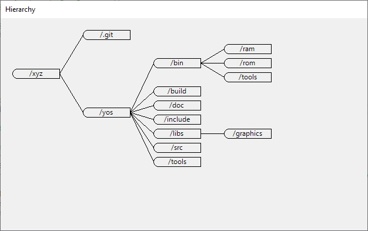

---

# LabelEx

Label that can rotate and supports transparency.

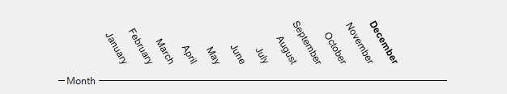

## Usage

Transparency is a pain in Windows Forms. This feature works well at runtime, but behaves 
naughty in the designer. The reason is that it avoids double buffering to implement 
transparency. To make the label background transparent, set the `Opacity` property 
from 0% to 100% (for fully transparent label). 

Rotate the label by setting the `Angle`. The unit is in degrees, and the rotation is clockwise.

Finally, you can align the rotated label to the bounding rectangle by assigning values to 
properies `HorzAlignment` and `VertAlignment`.

## Examples

~~~cs
_label.Text = "Oh, what a night\nLate December back in sixty - three\nWhat a very special time for me\nAs I remember what a night.";
_label.Angle = 45;
_label.HorzAlignment = StringAlignment.Center;
_label.VertAlignment = StringAlignment.Center;
~~~

And the result...

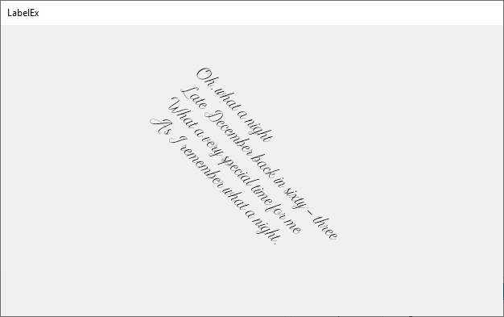

---

# Line

Vertical or horizontal line control, used as a separator or a decorator. 

## Usage

Set the `Orientation` property to `Horizontal` or `Vertical`. Use line 
`Thickness` to set the pen thickness. Set line `Text`,`Font`, and `ForeColor` 
properties to control appearance of title. If empty, no title is shown.
`TextAlignment` tells where the title is shown (at beginning, end or in the
middle of line). If at beginning or end then `TextOffset` (in pixels) is
used to move title away from begin/end point. `BackColor` controls line control 
background, and `LineColor` is used for line color. `DashValues` is an array
of floats that tells size of pixels and spaces. Default value of `{1,0}` means
solid line (i.e. one pixel, followed by zero spaces). A value of `{1,1}` is
interpreted as a pixel followed by a space. The pattern can be of arbitrary
length i.e. a value of `{3,1,1,1}` would be interpreted three pixels, 
followed by one space, followed by one pixel, followed by one space.

## Examples

~~~cs
_line.Orientation = Orientation.Horizontal;
_line.Text = string.Empty; // Remove text.
_line.LineColor = Color.Khaki;
_line.BackColor = Color.DarkSeaGreen;
_line.Thickness = 6;
_line.DashValues = new float[] { 3,1,1,1 };
~~~

---

# Monitors

With the Monitors control you can show user his or her multi-monitor confiruation
and enable him or her to to select one. This is useful for creating multi-monitor 
apps that open multiple windows. You can let user configure target monitors for
these windows.

 > The control will automatically detect size and placement of connected monitors.

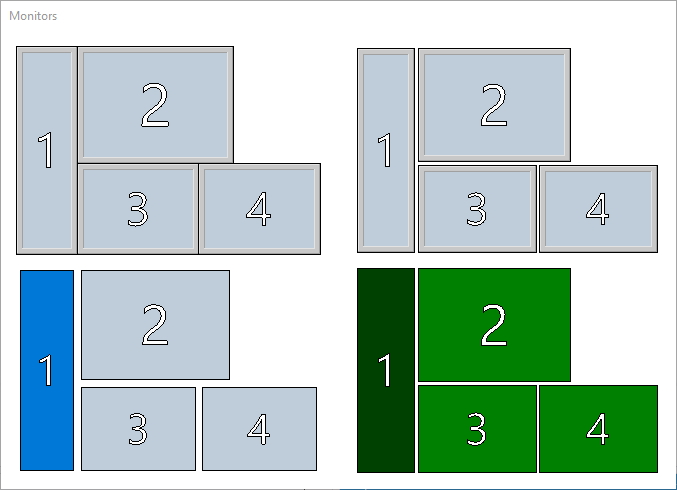

## Usage

### Margin and padding

Place the control on your window. All your monitors will be selected and drawn
in default colors. You can configure the `Padding` property to create space between
monitors. You can also set the `Margin` property for this control.

### Monitor number

If you set the `ShowNumber` property - numbers will be displayed inside
monitors. You can toggle font for displaying numbers by setting the `Font` 
property.

Numbers are displayed as outline text. Border color for each number is configured
by setting `MonitorTextForeColor`, and the inner color of text is configured 
via the `MonitorTextBackColor`.

### Monitor edge

Each monitor can be a square or it can have a 3D border *like real life monitors
do*. If you'd like a border then you must set the `ShowEdge` property. You can
configure 3D colors by setting the `EdgeLightColor` and `EdgeDarkColor`.
The space between the outer border and the inner border is configured by setting
the `EdgeThickness` value.

### Active monitor

When moving (hovering) the mouse over monitors will be highlighted. To set the 
colors of monitor under the mouse, use the `ActiveMonitorBackColor` and
`ActiveMonitorBackColor` properties.

You can manually activate a monitor (without mouse over it) by setting the 
`Activate` property to monitor number.

### Select monitor

When clicking on a monitor you select it and an event called `MonitorSelected` 
is raised.

 > You can also capture the `MonitorUnselected` event to dected when a monitor is
 > unselected.

You can set the selected monitor manually via the `Selected` numeric property. 

The visual effects for selected monitor are configured by properties `SelectedMonitorBackColor`
and `SelectedMonitorForeColor`.

### Monitor color

Monitor only uses one color, called the `MonitorBackColor`. Set it to whatever the
standard back color for the monitor should be.

---

# SecurityMatrix

A highly configurable classic *permissions and roles* grid editor. It accepts 
a feed interface which must provide a list of roles, permission categories, 
and permissions. A demo feed implementation is part of the control. 

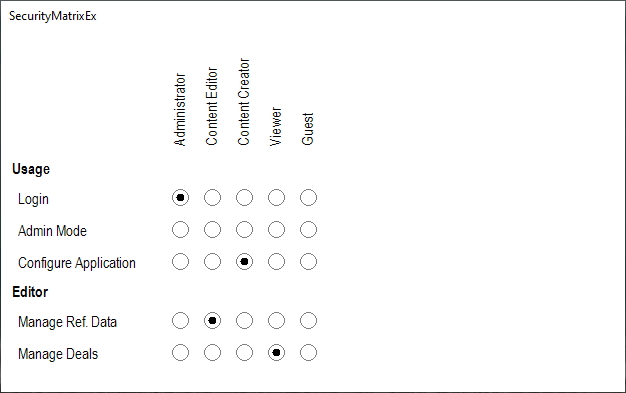

You can configure fonts and colors of the control, or implement custom drawing.
Custom drawing is implemented by overriding the control's paint functions.

## Usage

Place the `SecurityMatrix` on your window. It will show a demo matrix enabling you
to customize its' appearance.

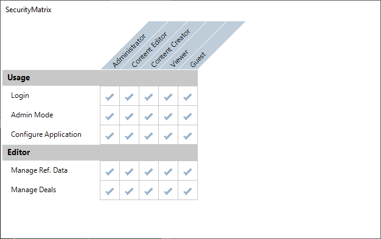

Call the `SetFeed()` function to pass the data to it. Set angle for roles by setting
the `RolesAngle` property. Reserve space on top and on left for roles and categories
by setting the `RolesHeight` and `CategoriesWidth` properties. Set the tick cell 
size by setting property `CellSize`. 

You can configure fore and front colors, and fonts for matrix titles on the top
and left. You can also configure cells' fore and front colors. Finally, when the
mouse hovers over the cell it will change color if you set the `PermissionActiveCellBackColor`
property.

## Implementing the feed

To implement the feed interface, you need to implement four functions.

~~~cs
public interface ISecurityMatrixFeed
{
    IEnumerable<SecurityRole> QueryRoles();
    IEnumerable<SecurityCategory> QueryCategories();
    IEnumerable<SecurityPermission> QueryPermissions(SecurityCategory category);
    bool this[SecurityRole r, SecurityCategory c, SecurityPermission p] { get; set; } 
}
~~~

Functions accept parameters of types SecurityRole, SecurityPermission, and/or SecurityCategory
which are all derived from `KeyNamePair` and must contain two values: 
 * a display name, and 
 * a unique identifier.

~~~cs
public class KeyNamePair
{
    public string Id { get; set; }
    public string DisplayName { get; set; }
}
public class SecurityRole : KeyNamePair {}
public class SecurityCategory : KeyNamePair {}
public class SecurityPermission : KeyNamePair {}
~~~

Function `QueryRoles()` should return all roles that you'd like to have displayed
on top. Function `QueryCategories()` should return all categories into which you would
like to group permissions. Function `QueryPermissions()` takes a category object as a
parameter and returns all permissions pertaining to this category. And finally,
indexer `this[SecurityRole, SecurityCategory, SecurityPermission]`is used to 
access the ticks. 

### Binding ticks to database

The indexer inside the feed can be connected to the database, update it on set and
read from it on get. Following is a naive implementation of indexer as a list.

~~~cs
private class Check
{
    public SecurityRole SecurityRole { get; set; }
    public SecurityCategory SecurityCategory { get; set; }
    public SecurityPermission SecurityPermission { get; set; }
    public bool Value { get; set; }
}
// ...code omitted...
private List<Check> _checks;
// ...code omitted...
public bool this[SecurityRole r, SecurityCategory c, SecurityPermission p] { 
    get {
        var chk = _checks.FirstOrDefault(chk =>
            chk.SecurityRole.Id.Equals(r.Id)
            && chk.SecurityCategory.Id.Equals(c.Id)
            && chk.SecurityPermission.Id.Equals(p.Id));
        if (chk == null) return false;
        else return chk.Value;
    }
    set
    {
        var chk = _checks.FirstOrDefault(chk =>
            chk.SecurityRole.Id.Equals(r.Id)
            && chk.SecurityCategory.Id.Equals(c.Id)
            && chk.SecurityPermission.Id.Equals(p.Id));
        if (chk != null)
            chk.Value = value;
        else
            _checks.Add(new Check() { 
                SecurityRole=r, SecurityCategory=c, SecurityPermission=p, Value=value 
            });
    }
} 
~~~

### Custom paint

You can derive your own control from the `SecurityMatrix` and implement custom
paint handlers for every aspect of the grid.

~~~cs
public class SecurityMatrixEx : SecurityMatrix
{
    protected override void DrawTick(Graphics g, Rectangle rect)
    {
        rect.Inflate(-12, -12);
        using (Pen tickPen = new Pen(Color.Black, 2))
        {
            g.DrawLine(tickPen, rect.Location, new Point(rect.Right, rect.Bottom));
            g.DrawLine(tickPen, new Point(rect.Right, rect.Top), new Point(rect.Left, rect.Bottom));
        }
    }

    protected override void DrawPermissionCellBackground(Graphics g, Rectangle rect, SecurityRole r, SecurityCategory c, SecurityPermission p)
    {
        rect.Inflate(-8, -8);
        g.DrawRectangle(Pens.Gray, rect);
    }

    protected override void DrawPermissionCellForeground(Graphics g, Rectangle rect, SecurityRole r, SecurityCategory c, SecurityPermission p)
    { // Don't draw rectangle around it!
    }
}
~~~

This code above changes ticks to squares, and produces the following output:

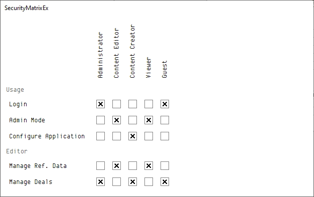

You can override following paint functions.

~~~
void DrawRoleBackground(Graphics g, Point[] pts, SecurityRole role)
void DrawRoleForeground(Graphics g, Rectangle r, SecurityRole role)
void DrawPermissionBackground(
            Graphics g,
            Rectangle r,
            SecurityCategory category,
            SecurityPermission permission)
void DrawPermissionForeground(
            Graphics g,
            Rectangle r,
            SecurityCategory category,
            SecurityPermission permission)
void DrawTick(Graphics g, Rectangle rect)
void DrawPermissionCellBackground(
            Graphics g,
            Rectangle rect,
            SecurityRole r,
            SecurityCategory c,
            SecurityPermission p)
void DrawPermissionCellForeground(
            Graphics g,
            Rectangle rect,
            SecurityRole r,
            SecurityCategory c,
            SecurityPermission p)
void DrawCategoryForeground(Graphics g, Rectangle r, SecurityCategory category)
void DrawCategoryBackground(Graphics g, Rectangle r, SecurityCategory c)
void DrawCategoryCellBackground(Graphics g, Rectangle rect, SecurityRole r, SecurityCategory c)
void DrawCategoryCellForeground(Graphics g, Rectangle rect, SecurityRole r, SecurityCategory c)
~~~

All the sizing and rotation operations are implemented by the control so you don't have
to worry about it i.e. you don't need to draw rotated text for the role, it is rotated and placed to
the correct rectangle for you by the control.

## ToDo

Keyboard and focus handling.

---

# SpriteGrid

Raster image viewer (with mouse events and zoom), a basis for a sprite editor.

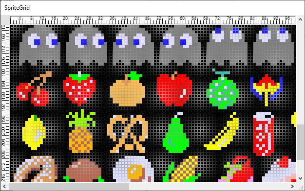

## Usage

Place the `SpriteGrid` control on your window. Set its `SourceImage` property to
the `Bitmap` you'd like to view or edit and you're done. 

You can show or hide rulers using the `ShowHorzRuler` and `ShowVertRuler` properties.
You can customize rulers by manipulating properties: `RulerHeight`, `RulerWidth`, 
`RulesBackgroundColor`, `MinorTickSize`, `MajorTickSize`, and 'MinorTicksPerMajorTick'.

You can customize grid appearance by manipulating properties `GridEdgeLineColor`,`GridEdgeLineDashPattern`,
`GridTickLineColor`, `GridTickLineDashPattern`.

`BackColor` is used to draw empty grid, and `ForeColor` is used for all text (currently just
the ruler content).

## Examples

### Passing image

You pass image to SpriteGrid by assigning the image to the `SourceImage` property.

~~~cs
_spriteGrid.SourceImage = Image.FromFile("pacman.png");
~~~

### Responding to events

SpriteGrid exposes basic mouse events and translates physical coordinates to logical
coordinates inside the sprite (i.e. row and column). To manipulate the sprite, 
simply manipulate the underlying image and call the `Refresh()` function on
SpriteGrid.

~~~cs
public partial class MainWnd : Form
{
    // ... code omitted ...
    private Bitmap _sprite;

    private void MainWnd_Load(object sender, System.EventArgs e)
    {
        // Create new 16x16 sprite.
        _spriteGrid.SourceImage = _sprite = new Bitmap(16, 16);
    }

    private void _spriteGrid_CellMouseDown(object sender, CellMouseButtonArgs e)
    {
        // Set image pixel.
        _sprite.SetPixel(e.Column, e.Row, Color.Black);
        _spriteGrid.Refresh();
    }
    // ... code omitted ...
}
~~~

### Implementing zoom

SpriteGrid uses mouse wheel for two purposes. If wheel is used without any control
key then sprite is scrolled up and down. If, while using the mouse wheel, you hold
down Ctlr key then the `ZoomIn` and `ZoomOut` events are triggered. You can use
this to implement zoom.

The simplest implementation (which would not consider the current mouse position),
would be increasing and decreasing values or properties `CellWidth` and `CellHeight`.

~~~cs
private void _spriteGrid_ZoomIn(object sender, ZoomInArgs e)
{
    if (_spriteGrid.CellWidth < 32) _spriteGrid.CellWidth++;
    if (_spriteGrid.CellHeight < 32) _spriteGrid.CellHeight++;
}

private void _spriteGrid_ZoomOut(object sender, ZoomOutArgs e)
{
    if (_spriteGrid.CellWidth > 1) _spriteGrid.CellWidth--;
    if (_spriteGrid.CellHeight > 1) _spriteGrid.CellHeight--;
}
~~~

And the result.

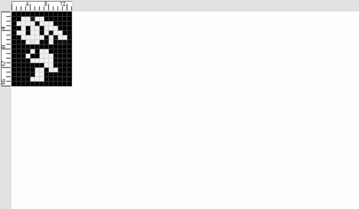

### Visible margins

Sometimes it makes sense to set a visible sprite margin (for example, to show where
image will be cropped). Six properties controling sprite margin: `LeftMargin`,
`RightMargin`, `TopMargin`, `BottomMargin`, `MarginLineThickness`, and
`MarginColor`.

 > Sprite margin is not the same as control margin. Sprite margin is an area of sprite
 > that is visibly marked.

~~~cs
_spriteGrid.SourceImage = Image.FromFile("art.png");
_spriteGrid.LeftMargin = 40;
_spriteGrid.RightMargin = 40;
_spriteGrid.TopMargin = 30;
_spriteGrid.BottomMargin = 40;
_spriteGrid.MarginLineThickness = 4;
_spriteGrid.MarginColor = Color.Red;
~~~

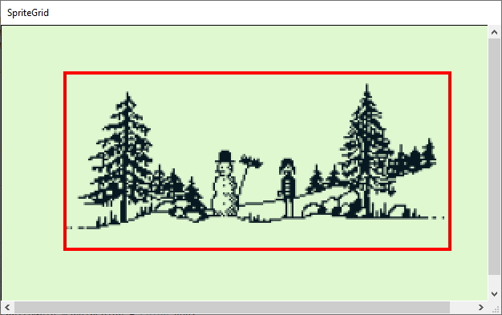

### Selections

By responding to mouse events `CellMouseDown`, `CellMouseUp, `CellMouseMove` you 
can detect select operation.

 > To differentiate between a select and a pixel click you need to compare mouse
 > coordinates at `CellMouseDown` event with that of `CellMouseUp`. If 
 > coordinates are the same and there were no `CellMouseMove` events out o the
 > cell then it is a click. Otherwise it is a select.

To make SpriteEdit draw a selection you set the property GridSelection. 
GridSelection is a polygon and can be of any shape.

~~~cs
_spriteGrid.SourceImage = Image.FromFile("jetpac.png");
_spriteGrid.SetGridSelection(new GridSelection()
{
    LineColor = Color.White,
    LineWidth = 3,
    Poly = new Point[] { 
        new Point(200,200), 
        new Point(400, 200), 
        new Point(400,400), 
        new Point(200,400)}
});
~~~

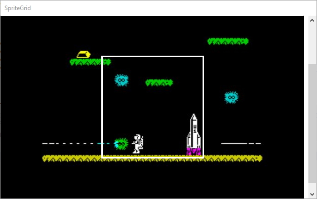

---

# Hire me

All these controls are totally free. If you'd like to spice up (improve!) 
your project with intriguing custom controls, *but you lack the skills*, 
I am available for short term contracts - from a few days to a few weeks. 
My rate is from 450£ to 550£ per day. 

---
`tomaz dot stih at wischner dot co dot uk`